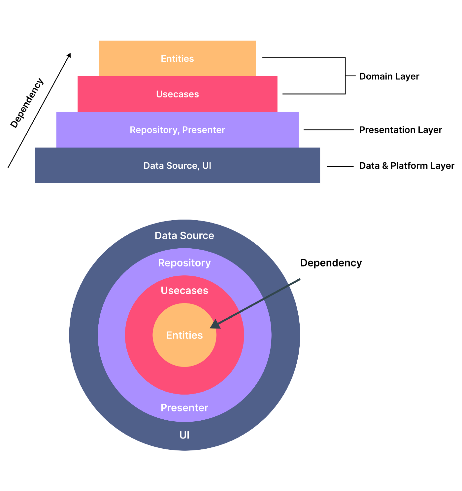

# Project Architecture.
> Este documento estará en español y se traducirá al inglés cuando se considere necesario.

> Fuente principal para esta guía: https://betterprogramming.pub/flutter-clean-architecture-test-driven-development-practical-guide-445f388e8604

## Clean Architecture
Este proyecto implementará arquitectura limpia.



Como en el diagrama anterior, la arquitectura limpia se representa como una pirámide o una rebanada de cebolla cuando se ve desde arriba. La arquitectura limpia dividirá el proyecto Flutter en 3 capas principales, a saber:

### Capa de datos y de plataforma
La capa de datos se encuentra en la capa más externa. Esta capa consta de código fuente de datos, como consumir API Rest, acceso a la base de datos local, Firebase u otras fuentes. 

### Capa presentación
La capa de presentación consiste en el código para acceder a los datos de la aplicación desde un repositorio. Además, existe el código para la gestión estatal, como proveedores, BLoC, etc. Además, en esta capa, suele estar el código de la plataforma que crea la interfaz de usuario (widgets).

### Capa dominio
La capa de dominio es la más profunda en la arquitectura limpia. Esta capa contiene el código para aplicaciones de lógica empresarial, como entidades y casos de uso.

> Cada capa depende de las otras capas. Las flechas en el diagrama muestran cómo se relacionan las capas. La capa más externa dependerá de la capa interna y así sucesivamente

Con estos conceptos aplicados, la estructura del proyecto se vería así:

```
lib
├── data
│   ├── constants.dart
│   ├── datasources
│   │   └── remote_data_source.dart
│   ├── exception.dart
│   ├── failure.dart
│   ├── models
│   │   └── model.dart // use entity (fromJson, to Json)
│   └── repositories
│       └── data_source_impl.dart // implementa repositorio de dominio, usa data source.
├── domain
│   ├── entities
│   │   └── entity.dart
│   ├── repositories
│   │   └── abstract_repository.dart
│   └── usecases
│       └── use_case.dart // use repository
├── injection.dart
├── main.dart
└── presentation
    ├── provider // Gestiona el estado
    └── pages
        └── one_page.dart
```

> Código de ejemplo completo: https://github.com/codestronaut/flutter-weather-app-sample